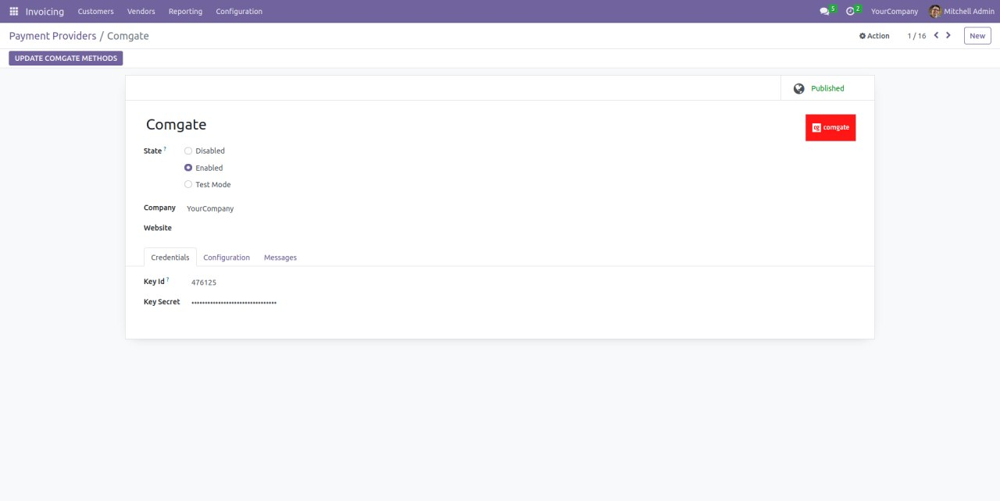
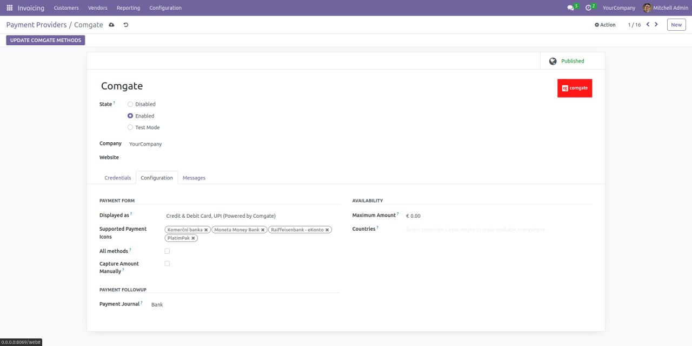
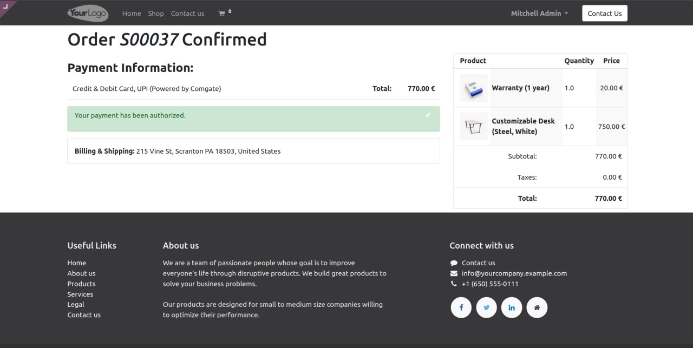
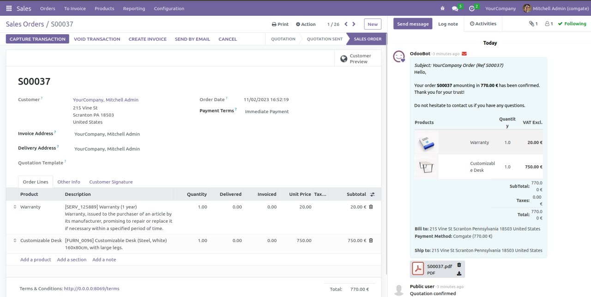
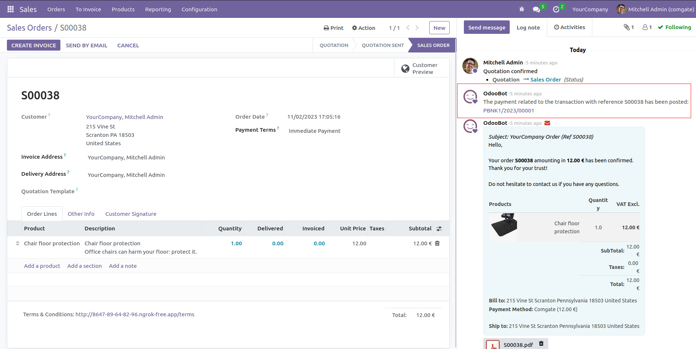
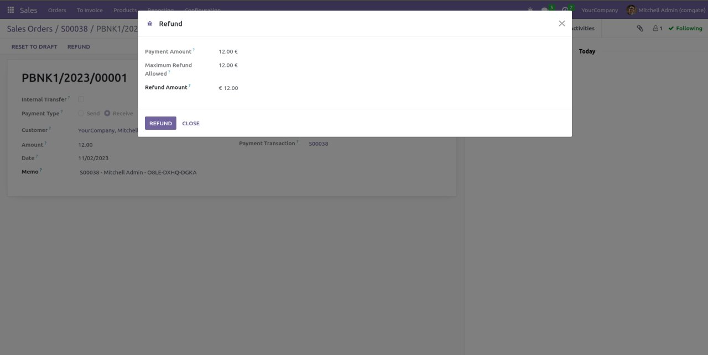

==========================
Payment Provider: Comgate
==========================

.. raw:: html

   

.. |badge1| image:: https://raster.shields.io/badge/license-Other_proprietary-blue.png
    :alt: License: Other proprietary

|badge1| 

| The module provides integration with payment gateway https://www.comgate.cz

**Table of contents**

.. contents::
   :local:

Comgate configuration
=====================

#. Go to *https://portal.comgate.cz*
#. *Integration > Shops settings > "your shop" > Shop connections > Edit*
#. Set *Enabled payment establishment type* to *HTTP POST protocol - backend or redirect*
#. Set IP whitelist
#. Set URL paid, cancelled, pending:

   * https://www.yourdomain.com/payment/status?id=${id}&refId=${refId}
   * https://www.yourdomain.com/payment/status?id=${id}&refId=${refId}
   * https://www.yourdomain.com/payment/status?id=${id}&refId=${refId}
#. Set URL for payment result transfer:

   * https://www.yourdomain.com/payment/comgate/return

Odoo configuration
==================

* Go to *Invoicing > Configuration > Payment Providers > Comgate* (Enterprise edition: *Accounting > Configuration > Payment Providers > Comgate*)
* Fill *Key ID and Key Secret* obtained from Comgate (https://www.comgate.cz/objednat)

Payment methods
===============

| There is option to choose allowed payment methods

* Go to *Invoicing > Configuration > Payment Providers > Comgate* (Enterprise edition: *Accounting > Configuration > Payment Providers > Comgate*)
* Press button *Update Comgate Methods*
* Select supported payment icons or press *All methods* if you want to support all payment methods

Preauthorization
================

| If you want to capture payments you need to:

#. Go to *Invoicing > Configuration > Payment Providers > Comgate > Configuration* (Enterprise edition: *Accounting > Configuration > Payment Providers > Comgate*)
#. Enable *Capture Amount Manually*

|
| After payment user will see that payment was preauthorized
|

|
| You will be able to capture or void transaction
|

Refund
======
| Comgate supports partial and full refunds.

* Go to *Sales > Orders*

   
|
| Click on payment related to the transaction and press *Refund*
|

Author
======

* Data Dance s.r.o.

Contact
=======
https://www.datadance.eu/